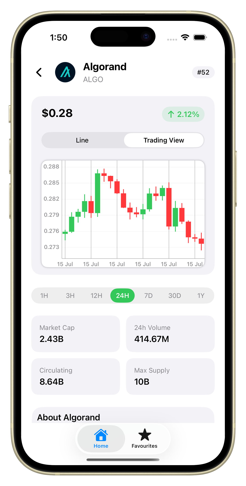

<h1 align="center">
 
  
 
 
CoinPulse
</h1>
 

<table>
  <tr>
    <td align="center"> Splashscreen</td>
    <td align="center"> MarketCap</td>
    <td align="center"> 24hour change</td>
  </tr>
  <tr>
    <td align="center"> Price</td>
    <td align="center"> Line Chart</td>
    <td align="center"> Trading View</td>
  </tr>
  <tr>
    <td align="center"> Details</td>
    <td align="center"> Favourites</td>
    <td align="center">
      <a href="screenshot/appvideo.mp4">
         App Demo 🎬
      </a>
    </td>
  </tr>
</table>

#### ✅ Testing
This project includes the following tests to ensure quality and reliability: 
- ✅ Core Data Persistence Tests    

To run all tests:  
- Press **⌘ + U** in Xcode  
- Or go to **Product > Test** in the Xcode menu  
---

### 🧪 Test Results

| Test Coverage Snapshot |
|:-----------------------:|
|  |
